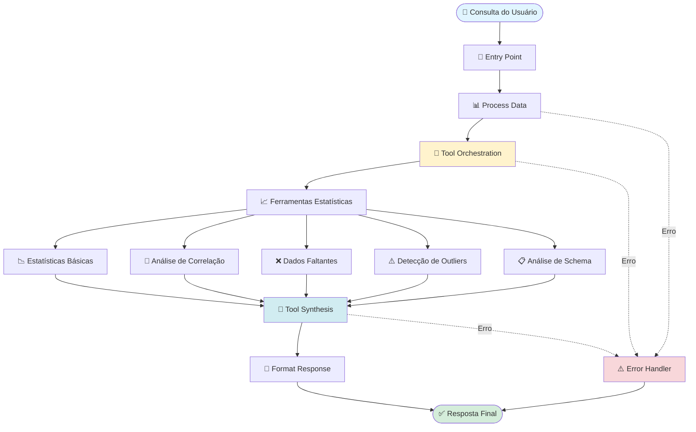
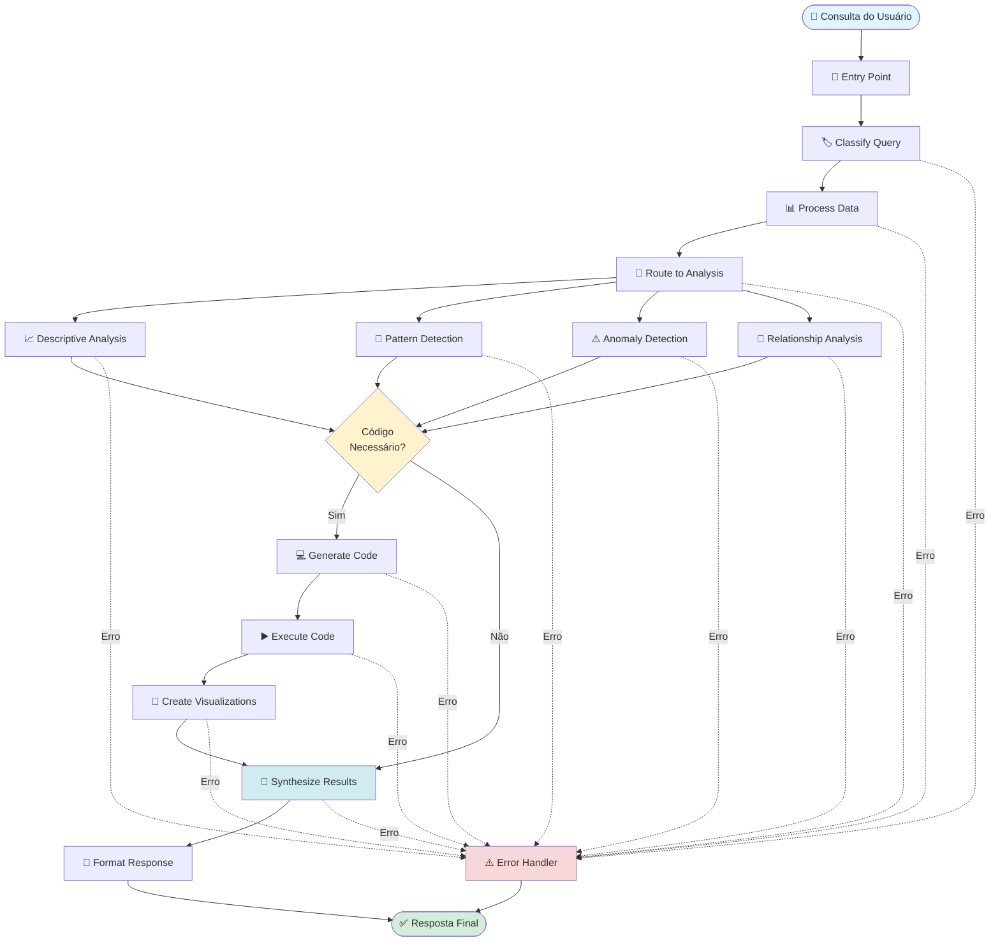
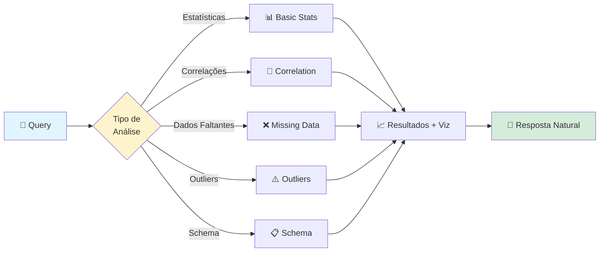

<div align="center">

# 📊 EDA Agent

### Sistema Multi-Agente Inteligente para Análise Exploratória de Dados

[](https://www.python.org/downloads/)
[](https://python.langchain.com/)
[](https://streamlit.io/)

**Transforme seus dados em insights através de conversas em linguagem natural**

[Funcionalidades](#-funcionalidades) •
[Instalação](#-instalação) •
[Uso](#-uso) •
[Arquitetura](#-arquitetura-multi-agente) •
[Documentação](#-desenvolvimento)

</div>

---

## ✨ Funcionalidades

<table>
<tr>
<td width="50%">

### 🤖 **Inteligência Multi-Agente**
- Sistema orquestrado de agentes especializados
- Análise coordenada e colaborativa
- Workflow adaptativo baseado em LangGraph

</td>
<td width="50%">

### 💬 **Interface Natural**
- Consultas em linguagem natural
- Conversação contextual
- Memória de sessão inteligente

</td>
</tr>
<tr>
<td width="50%">

### 📈 **Análises Avançadas**
- Estatísticas descritivas completas
- Detecção de padrões e anomalias
- Análise de correlações e relacionamentos
- Identificação automática de outliers

</td>
<td width="50%">

### 🎨 **Visualizações Automáticas**
- Gráficos gerados automaticamente
- Suporte para Matplotlib e Plotly
- Visualizações interativas
- Exportação em múltiplos formatos

</td>
</tr>
<tr>
<td width="50%">

### 🔒 **Segurança**
- Execução de código em sandbox isolado
- Validação rigorosa de entrada
- Sanitização de código gerado
- Logs detalhados de operações

</td>
<td width="50%">

### ⚡ **Performance**
- Processamento otimizado de grandes datasets
- Cache inteligente de resultados
- Execução assíncrona
- Gerenciamento eficiente de recursos

</td>
</tr>
</table>

---

## 🏗 Arquitetura Multi-Agente

O EDA Agent utiliza uma arquitetura sofisticada baseada em **LangGraph**, onde múltiplos agentes especializados trabalham de forma coordenada para fornecer análises completas e precisas.

### 🎯 Agentes Especializados

| Agente | Função | Responsabilidades |
|--------|--------|-------------------|
| 🔍 **Data Analyzer** | Análise Descritiva | Estatísticas básicas, distribuições, valores faltantes |
| 🧩 **Pattern Detector** | Detecção de Padrões | Tendências, sazonalidade, agrupamentos |
| ⚠️ **Anomaly Detector** | Detecção de Anomalias | Outliers, valores atípicos, inconsistências |
| 🔗 **Relationship Analyzer** | Análise de Relacionamentos | Correlações, dependências, causalidade |
| 💻 **Code Generator** | Geração de Código | Código Python otimizado para análises |
| 📝 **Conclusion Generator** | Síntese de Resultados | Insights finais, conclusões, recomendações |

### 🔄 Fluxo do Workflow (Tool-Based)

O sistema utiliza um workflow simplificado e eficiente baseado em ferramentas estatísticas:



### 🔄 Fluxo Alternativo (Agent-Based)

Para análises mais complexas, o sistema pode utilizar o workflow completo baseado em agentes:



### 🛠️ Ferramentas Estatísticas

O sistema possui ferramentas especializadas para diferentes tipos de análise:



### 🧠 Sistema de Memória Contextual

O EDA Agent mantém contexto entre consultas, permitindo conversações naturais:

- **Memória de Curto Prazo**: Mantém contexto da sessão atual
- **Memória de Longo Prazo**: Armazena análises anteriores (opcional)
- **Contexto de Conversa**: Entende referências a análises prévias

---

## 📁 Estrutura do Projeto

```
EDA_Agent_deploy/
├── 📄 app.py                       # Interface Streamlit principal
├── 📄 pyproject.toml               # Configuração e dependências
├── 📄 requirements.txt             # Dependências para deploy
├── 📄 LICENSE                      # Licença MIT
├── 📄 README.md                    # Esta documentação
├── 📄 CONTRIBUTING.md              # Guia de contribuição
│
├── 📂 .streamlit/
│   └── config.toml                 # Configurações do Streamlit
│
├── 📂 src/
│   ├── 📂 agents/                  # 🤖 Agentes especializados
│   │   ├── anomaly_detector.py     # Detecção de anomalias
│   │   ├── code_generator.py       # Geração de código Python
│   │   ├── conclusion_generator.py # Síntese de insights
│   │   ├── data_analyzer.py        # Análise descritiva
│   │   ├── pattern_detector.py     # Detecção de padrões
│   │   └── relationship_analyzer.py # Análise de relacionamentos
│   │
│   ├── 📂 core/                    # ⚙️ Lógica principal
│   │   ├── code_executor.py        # Execução segura de código
│   │   ├── config.py               # Configurações do sistema
│   │   ├── csv_processor.py        # Processamento de CSV
│   │   ├── llm_manager.py          # Gerenciamento de LLMs
│   │   ├── logger.py               # Sistema de logs
│   │   ├── memory_manager.py       # Gerenciamento de memória
│   │   └── query_interpreter.py    # Interpretação de consultas
│   │
│   ├── 📂 graph/                   # 🔄 Workflow LangGraph
│   │   ├── edges.py                # Lógica de transições
│   │   ├── nodes.py                # Implementação dos nós
│   │   ├── state.py                # Estado compartilhado
│   │   └── workflow.py             # Orquestração principal
│   │
│   ├── 📂 models/                  # 📊 Modelos de dados
│   │   ├── analysis_result.py      # Resultados de análise
│   │   ├── enums.py                # Enumerações
│   │   ├── graph_schema.py         # Schemas do grafo
│   │   └── query_schema.py         # Schemas de consulta
│   │
│   ├── 📂 tools/                   # 🛠️ Ferramentas de análise
│   │   ├── basic_stats.py          # Estatísticas básicas
│   │   ├── correlation_analysis.py # Análise de correlação
│   │   ├── missing_data_analysis.py# Análise de dados faltantes
│   │   ├── outlier_detection.py    # Detecção de outliers
│   │   ├── schema_analysis.py      # Análise de schema
│   │   └── visualization_tools.py  # Ferramentas de visualização
│   │
│   ├── 📂 utils/                   # 🔧 Utilitários
│   │   ├── file_handler.py         # Manipulação de arquivos
│   │   ├── formatters.py           # Formatação de saída
│   │   ├── graph_generator.py      # Geração de gráficos
│   │   ├── security.py             # Validações de segurança
│   │   └── validators.py           # Validadores de dados
│   │
│   └── 📂 interface/               # 🖥️ Componentes de interface
│       ├── error_handler.py        # Tratamento de erros
│       ├── session_manager.py      # Gerenciamento de sessão
│       ├── streamlit_components.py # Componentes customizados
│       └── visualization_renderer.py # Renderização de gráficos
│
└── 📂 tests/                       # ✅ Testes automatizados
    ├── conftest.py                 # Configurações pytest
    ├── fixtures/                   # Dados de teste
    ├── test_agents.py              # Testes dos agentes
    ├── test_core.py                # Testes do core
    ├── test_graph.py               # Testes do workflow
    ├── test_models.py              # Testes dos models
    ├── test_utils.py               # Testes dos utils
    └── test_end_to_end.py          # Testes end-to-end
```

---

## 🚀 Instalação

### Pré-requisitos

- **Python 3.9+**
- **Chave de API do OpenAI** ([Obter aqui](https://platform.openai.com/api-keys))
- Opcional: Chave do LangChain para tracing

### Instalação Rápida

```bash
# 1️⃣ Clone o repositório
git clone https://github.com/seu-usuario/eda-agent.git
cd eda-agent

# 2️⃣ Crie um ambiente virtual
python -m venv venv

# Linux/Mac
source venv/bin/activate

# Windows
venv\Scripts\activate

# 3️⃣ Instale as dependências
pip install -e .

# 4️⃣ Configure as variáveis de ambiente
cp .env.example .env
# Edite o arquivo .env com suas credenciais
```

### Configuração do `.env`

```ini
# OpenAI Configuration (OBRIGATÓRIO)
OPENAI_API_KEY=sk-proj-...

# LangChain Configuration (OPCIONAL)
LANGCHAIN_TRACING_V2=false
LANGCHAIN_API_KEY=lsv2_pt_...

# Application Configuration
APP_ENV=development
LOG_LEVEL=INFO

# File Upload Settings
MAX_UPLOAD_SIZE_MB=200
ALLOWED_EXTENSIONS=csv

# Code Execution Settings
EXECUTION_TIMEOUT=30
SAFE_MODE=true
```

---

## 💻 Uso

### Iniciando a Aplicação

```bash
streamlit run app.py
```

A aplicação estará disponível em **http://localhost:8501**

### 📝 Como Usar

<table>
<tr>
<td width="30px">1️⃣</td>
<td><b>Upload de Dados</b><br/>Faça upload de um arquivo CSV através da interface</td>
</tr>
<tr>
<td>2️⃣</td>
<td><b>Faça Perguntas</b><br/>Digite suas perguntas em linguagem natural no chat</td>
</tr>
<tr>
<td>3️⃣</td>
<td><b>Visualize Resultados</b><br/>Receba análises, gráficos e insights automaticamente</td>
</tr>
</table>

### 💡 Exemplos de Consultas

```text
📊 "Quais são as estatísticas descritivas dos dados?"

🔍 "Existem outliers nos dados numéricos?"

📈 "Mostre a correlação entre as variáveis"

❌ "Há valores faltantes? Como estão distribuídos?"

📉 "Analise a distribuição das variáveis numéricas"

🔗 "Qual a relação entre a idade e o salário?"

⚠️ "Identifique anomalias nos dados de vendas"

🧩 "Detecte padrões temporais nos dados"
```

---

## 🛠 Desenvolvimento

### Setup de Desenvolvimento

```bash
# Instalar dependências de desenvolvimento
pip install -e ".[dev]"
```

### Testes

```bash
# Executar todos os testes
pytest

# Com cobertura
pytest --cov=src tests/

# Testes específicos
pytest tests/test_agents.py
pytest tests/test_graph.py -v
```

### Qualidade de Código

```bash
# Formatação automática
black src/ tests/
isort src/ tests/

# Verificação de estilo
flake8 src/ tests/

# Type checking
mypy src/
```

### Estrutura de Testes

```
tests/
├── test_agents.py       # Testes dos agentes individuais
├── test_core.py         # Testes do núcleo do sistema
├── test_graph.py        # Testes do workflow LangGraph
├── test_models.py       # Testes dos modelos de dados
├── test_utils.py        # Testes dos utilitários
└── test_end_to_end.py   # Testes de integração completa
```

---

## 🚢 Deploy

### Streamlit Cloud (Recomendado)

<table>
<tr>
<td width="30px">1️⃣</td>
<td>Faça push do código para o GitHub</td>
</tr>
<tr>
<td>2️⃣</td>
<td>Acesse <a href="https://streamlit.io/cloud">Streamlit Cloud</a></td>
</tr>
<tr>
<td>3️⃣</td>
<td>Conecte seu repositório GitHub</td>
</tr>
<tr>
<td>4️⃣</td>
<td>Configure as variáveis de ambiente:<br/>
• <code>OPENAI_API_KEY</code><br/>
• Outras variáveis do <code>.env.example</code>
</td>
</tr>
<tr>
<td>5️⃣</td>
<td>Clique em Deploy! 🚀</td>
</tr>
</table>

### Docker (Opcional)

```bash
# Build da imagem
docker build -t eda-agent .

# Executar container
docker run -p 8501:8501 --env-file .env eda-agent
```

### Variáveis de Ambiente para Deploy

```bash
# Essenciais
OPENAI_API_KEY=sk-...           # OBRIGATÓRIO
APP_ENV=production              # Ambiente
LOG_LEVEL=INFO                  # Nível de log

# Opcionais
MAX_UPLOAD_SIZE_MB=200          # Tamanho máximo de upload
EXECUTION_TIMEOUT=30            # Timeout de execução
SAFE_MODE=true                  # Modo seguro
```

---

## ⚙️ Configuração Avançada

Todas as configurações estão em `src/core/config.py` e podem ser sobrescritas via variáveis de ambiente:

| Variável | Descrição | Padrão | Obrigatório |
|----------|-----------|--------|-------------|
| `OPENAI_API_KEY` | Chave da API OpenAI | - | ✅ |
| `LOG_LEVEL` | Nível de log (DEBUG, INFO, WARNING, ERROR) | INFO | ❌ |
| `EXECUTION_TIMEOUT` | Timeout de execução em segundos | 30 | ❌ |
| `MAX_UPLOAD_SIZE_MB` | Tamanho máximo de upload em MB | 200 | ❌ |
| `SAFE_MODE` | Modo seguro de execução de código | true | ❌ |
| `LANGCHAIN_TRACING_V2` | Habilitar tracing do LangChain | false | ❌ |
| `LANGCHAIN_API_KEY` | Chave da API do LangChain | - | ❌ |

---

## 🔒 Segurança

O EDA Agent implementa múltiplas camadas de segurança:

- ✅ **Sandbox Isolado**: Execução de código em ambiente controlado
- ✅ **Validação de Entrada**: Verificação rigorosa de todos os inputs
- ✅ **Sanitização de Código**: Limpeza e validação de código gerado
- ✅ **Restrição de Imports**: Bloqueio de importações perigosas
- ✅ **Timeout de Execução**: Limite de tempo para operações
- ✅ **Logs Detalhados**: Rastreamento completo de operações
- ✅ **Tratamento de Erros**: Gestão robusta de exceções

---

<div align="center">

**Desenvolvido com ❤️ usando Python, IA e uma boa dose de café ☕**

[⬆ Voltar ao topo](#-eda-agent)

</div>
